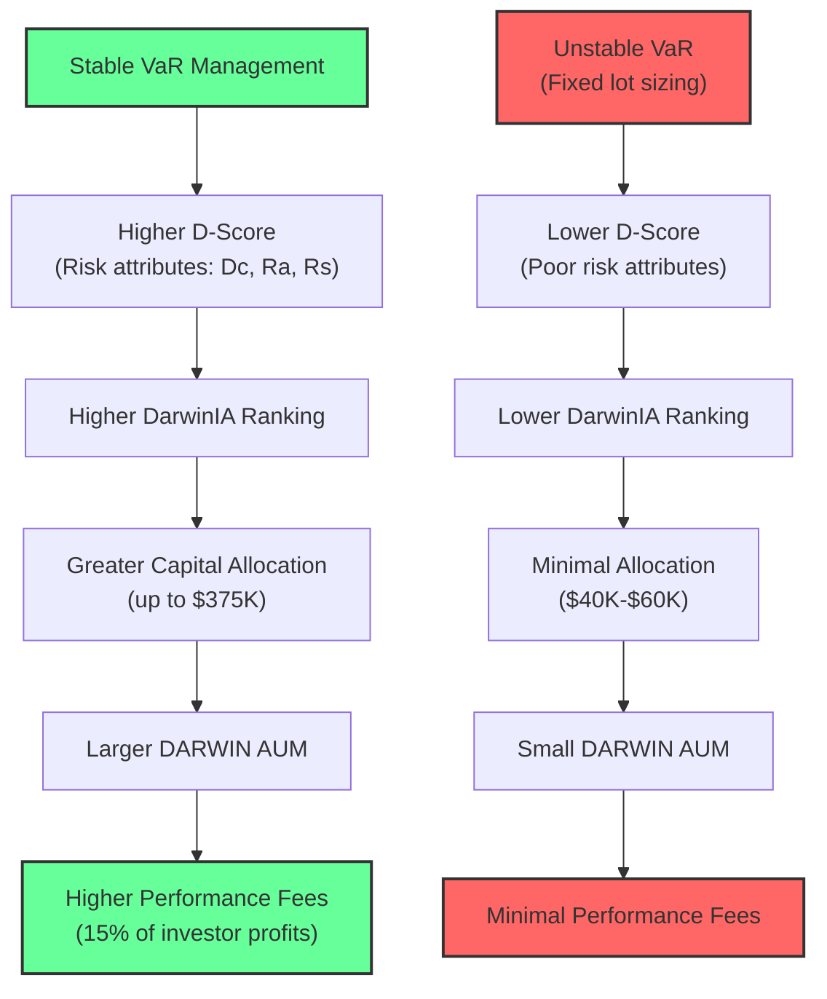

## Proactive Risk Management: The Superior Alternative to Fixed Lot Size Trading

> **Meta Description:** Learn how managing your trading strategy's risk with Darwinex's VaR-based risk engine is superior to using a fixed lot size, and how it can impact your capacity and performance fees.

---

In the world of trading, risk management is paramount. It's the invisible hand that guides your portfolio, protecting it from the market's inherent volatility. While there are many approaches to risk management, two common methods stand out: **fixed lot size trading** and **proactive VaR (Value at Risk) management**. In this article, we'll explore why the latter, especially in the context of a platform like Darwinex, is a far superior approach.

### The Two Approaches at a Glance

```mermaid
graph TD
    subgraph Fixed Lot Size
        F1["Set lot size once<br/>(e.g., 1.0 standard lot)"] --> F2["Market conditions change"]
        F2 --> F3{"Volatility spikes?"}
        F3 -->|"Yes"| F4["Same lot size<br/>RISK EXPLODES"]
        F3 -->|"No"| F5["Same lot size<br/>Risk stays low"]
        F4 --> F6["Inconsistent risk exposure<br/>Potential blowup"]
        F5 --> F7["Under-utilizing capital<br/>in calm markets"]
    end

    subgraph Proactive VaR Management
        P1["Target: 6.5% VaR<br/>(constant risk level)"] --> P2["Market conditions change"]
        P2 --> P3{"Volatility spikes?"}
        P3 -->|"Yes"| P4["REDUCE lot size<br/>Risk stays at 6.5%"]
        P3 -->|"No"| P5["INCREASE lot size<br/>Risk stays at 6.5%"]
        P4 --> P6["Consistent risk exposure<br/>Capital preserved"]
        P5 --> P7["Optimal capital usage<br/>in calm markets"]
    end

    style F4 fill:#f66,stroke:#333,stroke-width:2px
    style F6 fill:#f66,stroke:#333,stroke-width:2px
    style P4 fill:#6f9,stroke:#333,stroke-width:2px
    style P6 fill:#6f9,stroke:#333,stroke-width:2px
    style P5 fill:#6f9,stroke:#333,stroke-width:2px
    style P7 fill:#6f9,stroke:#333,stroke-width:2px
```

### The Flaw of Fixed Lot Size Trading

Fixed lot size trading is a simple concept: you trade the same position size for every trade, regardless of market conditions. While this approach is easy to implement, it's fraught with peril.

Imagine you're trading with a fixed lot size of **1 standard lot**. In a low-volatility market, this might be a reasonable risk. But what happens when volatility spikes? That same 1 standard lot now represents a much larger risk, potentially leading to catastrophic losses. This is the fundamental flaw of fixed lot size trading: it leads to **inconsistent risk exposure**.

**Let's put real numbers on this.**

Consider EURUSD with a fixed 1.0 lot position:

| Market Condition | ATR (14-day) | 1-Day Risk (1 lot) | Account Risk ($50K) |
|-----------------|-------------|-------------------|-------------------|
| Low vol (calm market) | 40 pips | $400 | 0.8% |
| Normal vol | 80 pips | $800 | 1.6% |
| High vol (crisis) | 200 pips | $2,000 | 4.0% |
| Extreme vol (2020 crash) | 350 pips | $3,500 | 7.0% |

Same lot size. Risk ranges from 0.8% to 7.0%. That's a **9x variation** in risk exposure from a "fixed" position size. In the low-vol environment you're barely moving the needle. In the extreme environment you're risking blowup. Neither is optimal.

**The hidden problem:** Fixed lot sizing also means your winners and losers are asymmetric in the wrong direction. When volatility is high (and losses are large), you're fully exposed. When volatility is low (and gains are small), you're fully exposed to... small gains. You're taking maximum risk for maximum loss potential and minimum risk for minimum gain potential. It's exactly backwards.

### Proactive Risk Management with Darwinex's VaR Engine

Darwinex takes a different approach. Instead of focusing on a fixed lot size, it focuses on a **fixed level of risk**, measured by Value at Risk (VaR). Darwinex's risk engine targets a monthly VaR of **6.5%**, with a corridor of **3.25%** to **6.5%**. This means that, for any given month, there's a **95% confidence level** that a DARWIN will not lose more than 6.5% of its value.

This is achieved through a process that can be described as **"VaR rubberbanding."** The risk engine constantly monitors the VaR of each DARWIN and dynamically adjusts the leverage to keep it within the target corridor. If a DARWIN's VaR starts to creep up towards the 6.5% limit, the risk engine will reduce the leverage, effectively shrinking the position size. Conversely, if the VaR drops, the risk engine will increase the leverage, allowing the trader to take on more risk.

**Same EURUSD trade with VaR-targeted sizing:**

| Market Condition | ATR (14-day) | Lot Size (VaR-adjusted) | 1-Day Risk | Account Risk ($50K) |
|-----------------|-------------|----------------------|-----------|-------------------|
| Low vol | 40 pips | 2.5 lots | $1,000 | 2.0% |
| Normal vol | 80 pips | 1.25 lots | $1,000 | 2.0% |
| High vol | 200 pips | 0.5 lots | $1,000 | 2.0% |
| Extreme vol | 350 pips | 0.29 lots | $1,000 | 2.0% |

Constant 2.0% risk. Lot size adapts. This is how professional risk management works.

This proactive approach to risk management has several key benefits:

- **Consistent Risk Exposure:** By targeting a fixed VaR, Darwinex ensures that all DARWINs have a similar risk profile, regardless of the underlying strategy or the trader's individual risk tolerance.
- **Dynamic Leverage Adjustment:** The risk engine automatically adjusts the leverage to changing market conditions, protecting investors from excessive risk during volatile periods.
- **Improved Risk-Adjusted Returns:** By keeping the risk constant, Darwinex allows for a more accurate assessment of a trader's skill, leading to better risk-adjusted returns over the long term.

### The Compounding Advantage

Here's the mathematical reality that fixed-lot traders miss: **consistent risk exposure compounds better than variable risk exposure**, even with identical average returns.

Consider two traders over 10 trades, both averaging 2% return per trade:

**Fixed Lot Trader:** Returns vary wildly -- +8%, -5%, +1%, +6%, -4%, +3%, -2%, +5%, +1%, +7%. Average: +2%. But the sequence and variance matter. Large losses require larger gains to recover.

**VaR-Managed Trader:** Returns are smoother -- +2.5%, -1%, +2%, +3%, -1.5%, +2%, +1.5%, +2.5%, +1%, +3%. Average: +1.5%. Lower average, but the compounding is more efficient because you never dig a deep hole.

The VaR-managed trader often ends up with **more money** despite lower average returns, because they avoid the drawdown-recovery death spiral. A 20% loss requires a 25% gain just to break even. A 50% loss requires 100%. Consistent risk management keeps you out of this trap.

### Impact on Capacity and Performance Fees

The benefits of proactive risk management extend beyond just improved risk control. They also have a direct impact on a trader's capacity to take on investor capital and, consequently, their potential performance fees.

A DARWIN's capacity is determined by its ability to take on investor capital without significantly impacting the execution of its trades. A DARWIN with a **stable VaR** is seen as more reliable and is therefore given a higher capacity. This is because a stable VaR indicates that the trader is consistently managing their risk and is not prone to taking on excessive leverage.

This has a direct impact on performance fees. The more investor capital a DARWIN can attract, the higher the potential performance fees for the trader. By proactively managing their risk and maintaining a stable VaR, traders can increase their capacity and, in turn, their earning potential, even with the same trading performance.

### A Tale of Two Traders: A Corrected Scenario

Let's revisit our two traders, **Trader 1** (the "Steady Hand") and **Trader 2** (the "High Tilt" trader). Both start with a **$1,000,000** account, and both trade the same instrument, holding a single trade for an entire quarter.

**Trader 1: The Steady Hand**

Trader 1's low-leverage strategy results in a **10%** gain, bringing their account to **$1,100,000**. Their VaR remains stable and within the **3.25-6.5%** corridor throughout the quarter. The Darwinex risk engine doesn't need to intervene significantly, and the DARWIN's performance closely mirrors the signal account.

**Trader 2: The High Tilt Trader**

Trader 2's high-leverage strategy results in a **500%** gain, rocketing their account to **$6,000,000**. Here's how the VaR rubberbanding effect plays out in this corrected scenario:

1. **Initial High VaR:** At the beginning of the trade, Trader 2's high leverage will cause their VaR to be very high, likely exceeding the 6.5% limit. The Darwinex risk engine will immediately intervene, reducing the DARWIN's leverage to bring the VaR back in line with the target.
2. **Decreasing Relative VaR:** As the trade moves in their favor and their account balance grows, the *relative* VaR of their position decreases. A $100,000 position is much riskier for a $1,000,000 account than it is for a $6,000,000 account.
3. **Increasing DARWIN Lot Size:** The Darwinex risk engine sees this decreasing relative VaR and, to maintain the 6.5% target VaR, it will *increase* the leverage on the DARWIN. This means that as Trader 2's account grows, the DARWIN's lot size will also grow, and at an accelerating rate.

**The Performance Fee Windfall**

Let's look at the performance fees with this corrected understanding.

- **Trader 1:** With a stable VaR, the DARWIN's lot size remains relatively constant. With $1,000,000 in investor capital, they might have an average DARWIN lot size of 10 lots for the quarter, resulting in **$1,500** in performance fees.
- **Trader 2:** The DARWIN's lot size starts small, but as the account balance grows, the risk engine will increase the leverage to maintain the 6.5% VaR. This means the DARWIN's lot size will grow significantly. It might start at 2 lots, but by the end of the quarter, it could be 20, 30, or even more lots. This will result in a much larger profit for investors and, consequently, a much larger performance fee for Trader 2, potentially in the **tens of thousands of dollars**.

### The Counterintuitive Conclusion

The VaR engine doesn't punish aggressive trading -- it *normalizes* it. A trader who understands this can use it strategically:

- **If your signal account runs hot:** The DARWIN participation increases as your account grows. The engine rewards sustained momentum, not initial aggression.
- **If your signal account draws down:** The DARWIN participation decreases, protecting investor capital. Your drawdown is dampened relative to your signal.
- **The net effect:** Investors in your DARWIN get a smoother ride than your signal account. This is why stable VaR management attracts more capital -- investors prefer consistency over excitement.

### Conclusion

A trader who understands how to manage their VaR, even with a high-risk strategy, can significantly increase their earning potential on Darwinex. The key is to understand that the risk engine is not simply about reducing risk, but about **maintaining a consistent level of risk**. By understanding the VaR rubberbanding effect, a "high tilt" trader can use it to their advantage, increasing their DARWIN's lot size and, ultimately, their performance fees.

The fixed lot size approach is a relic of an era before sophisticated risk engines existed. It's the financial equivalent of using a typewriter when you have a computer. Proactive VaR management adapts to the market in real-time, protects capital during chaos, and deploys it efficiently during calm. There is no rational argument for fixed lot sizing when dynamic risk management is available.

Manage your VaR. Manage your drawdown. The returns will follow.
