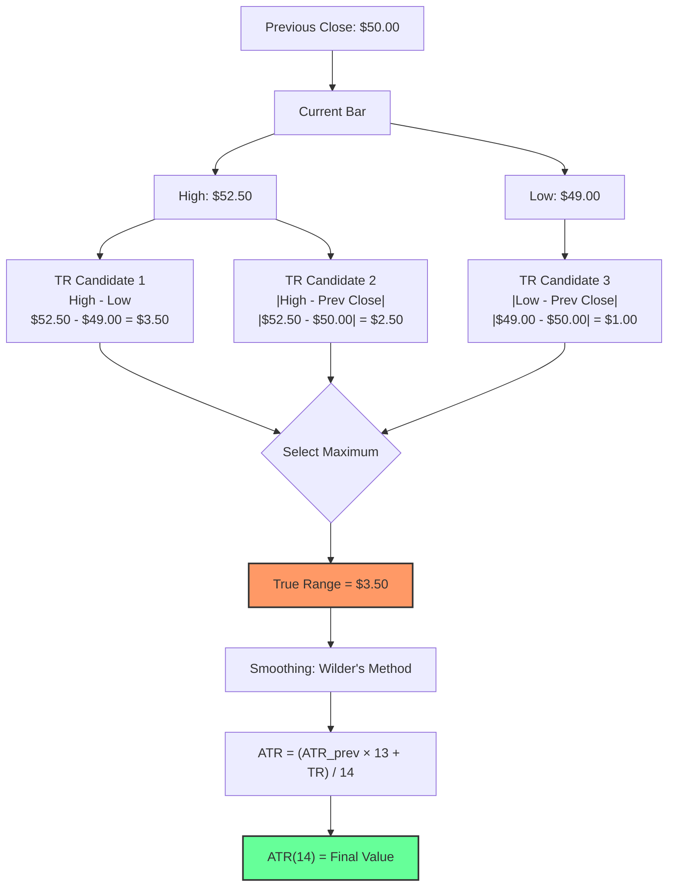

## What Is Average True Range (ATR)?

**Average True Range (ATR)** is a volatility indicator that measures the average range of price movement over a specified period. Unlike other volatility measures that focus on closing prices, ATR captures the full range of price action within each period, including gaps.

Developed by **J. Welles Wilder Jr.** in 1978, ATR has become a cornerstone of technical analysis and risk management systems. If you're sizing positions without ATR, you're essentially driving blindfolded. It's the single most important volatility metric for active traders.

### Understanding True Range

Before calculating ATR, you need to understand **True Range (TR)**, which is the greatest of:
1. `Current High - Current Low`
2. `|Current High - Previous Close|`
3. `|Current Low - Previous Close|`

True Range captures the largest price movement for that period, accounting for gaps between sessions.

**Why three calculations?** Consider a stock that closes at $50, then opens at $53 and trades between $53-$55. The High-Low range is only $2, but the *true* range from yesterday's close is $5. Without accounting for the gap, you'd massively underestimate volatility.

### ATR Calculation

    ATR = Moving Average of True Range over N periods

Traditional calculation uses Wilder's smoothing:

    ATR(today) = [(ATR(yesterday) × (N-1)) + TR(today)] / N

Where **N** is typically **14** periods (Wilder's original setting).

Modern implementations often use:
- **Simple Moving Average (SMA)**
- **Exponential Moving Average (EMA)**
- **Hull Moving Average (HMA)**

**Note on Wilder's smoothing:** It's essentially an EMA with a smoothing factor of 1/N. For a 14-period ATR, this means each new TR value contributes only ~7% to the ATR value. This creates a smooth, slow-moving indicator that doesn't whipsaw on single volatile bars.

### Interpreting ATR Values

**High ATR indicates:**
- Increased volatility
- Wider price swings
- Higher uncertainty
- Potential trend changes
- Increased risk

**Low ATR suggests:**
- Reduced volatility
- Consolidation phases
- Market equilibrium
- Lower risk periods
- Potential breakout setup

ATR is absolute, not relative -- a **$100** stock with ATR of **2** is less volatile (2%) than a **$10** stock with ATR of **1** (10%).

### Trading Applications

1. **Position Sizing**
   - `Risk per trade = Account Risk % / (ATR × multiplier)`
   - Higher ATR = smaller position size
   - Maintains consistent risk across different volatility regimes

   **Concrete Example:**
   - Account: **$100,000**, Risk per trade: **1%** ($1,000)
   - Stock A: Price $50, ATR = $2.00 (4% ATR/Price)
   - Stop distance: 2× ATR = $4.00
   - Position size: $1,000 / $4.00 = **250 shares** ($12,500 exposure)

   - Stock B: Price $150, ATR = $8.00 (5.3% ATR/Price)
   - Stop distance: 2× ATR = $16.00
   - Position size: $1,000 / $16.00 = **62 shares** ($9,300 exposure)

   Notice: Stock B gets fewer shares and less dollar exposure because it's more volatile. ATR automatically adjusts your sizing. This is the entire point.

2. **Stop Loss Placement**
   - Stop distance = `ATR × multiplier` (typically **1.5-3x**)
   - Adapts to market volatility
   - Reduces noise-based stop-outs

   **Why this matters:** A $2 stop on a stock with a $3 ATR will get hit by normal noise on most days. A stop at 2× ATR ($6) gives the trade room to breathe while still protecting capital.

3. **Profit Target Setting**
   - Target = `Entry ± (ATR × reward ratio)`
   - Risk-reward ratios based on volatility
   - Dynamic target adjustment

4. **Trend Strength Assessment**
   - Rising ATR + strong trend = momentum continuation
   - Falling ATR + weak trend = potential reversal
   - ATR divergence signals weakening moves

5. **Breakout Validation**
   - High ATR breakouts more likely to follow through
   - Low ATR breakouts often false signals
   - Volume + ATR confirmation

### ATR-Based Trading System Example

Here's a complete system using ATR for every decision:

**Entry:** Buy when price breaks above 20-day high AND ATR(14) is above its 50-period moving average (confirming volatility expansion).

**Position Size:** Risk 1% of account. Stop at entry minus 2× ATR. Shares = (Account × 0.01) / (2 × ATR).

**Stop Loss:** Initial stop at Entry - 2× ATR. Trail stop using: Previous Close - 3× ATR (Chandelier Exit).

**Profit Target:** Take 50% off at Entry + 3× ATR. Trail remainder.

**Exit:** When ATR drops below its 50-period average (volatility contracting, trend exhausting).

This system ensures that every parameter adapts to current market conditions. In low-vol environments, stops are tight and positions are large. In high-vol environments, stops are wide and positions are small. Risk remains constant.

### Advanced ATR Strategies

**ATR Bands:**
- Upper Band = `Price + (ATR × multiplier)`
- Lower Band = `Price - (ATR × multiplier)`
- Dynamic support/resistance levels

**ATR Percentage:**
- `ATR% = (ATR / Close) × 100`
- Normalizes ATR across different price levels
- Better for cross-asset comparison

**ATR Squeeze:**
- Identify periods of low volatility
- Anticipate volatility expansion
- Pre-position for breakout moves
- When ATR(14) drops below **50%** of its 100-period average, a volatility expansion is brewing

**Multi-Timeframe ATR:**
- Compare daily, weekly, monthly ATR
- Understand volatility context
- Scale position sizing appropriately
- Daily ATR << Weekly ATR suggests intraday mean-reversion; Daily ATR >> Weekly ATR suggests trending breakout

### ATR Limitations

1. **Lagging Indicator** -- ATR responds to volatility changes, doesn't predict them
2. **No Direction Bias** -- ATR measures magnitude, not direction of moves
3. **Smoothing Effects** -- Moving averages create lag in volatility detection
4. **Market Regime Dependency** -- ATR patterns vary across bull/bear/sideways markets
5. **Outlier Sensitivity** -- Single extreme moves can skew ATR for extended periods

### ATR vs Other Volatility Measures

**Standard Deviation:**
- Uses closing prices only
- ATR captures intraday range
- ATR more practical for stop placement

**Bollinger Bands:**
- Based on standard deviation
- ATR provides absolute volatility measure
- Complementary rather than competing

**VIX (Implied Volatility):**
- Forward-looking volatility expectations
- ATR measures historical realized volatility
- Different time horizons and perspectives

### Common ATR Settings

**Period Selection:**
- **14** periods (Wilder's original)
- **21** periods (monthly cycle)
- **10** periods (faster response)
- **50+** periods (long-term volatility)

**Multipliers:**
- **1.0x** ATR: Tight stops, more whipsaws
- **2.0x** ATR: Balanced approach
- **3.0x** ATR: Loose stops, fewer false signals

**Timeframes:**
- Scalping: 1-5 minute charts
- Day trading: 15-60 minute charts
- Swing trading: Daily charts
- Position trading: Weekly/monthly charts

### The MarketWizardry ATR Explorer

Our ATR calculator provides:
- Multiple moving average methods
- ATR percentile analysis
- Multi-timeframe ATR comparison
- Position sizing calculators
- Risk-adjusted stop levels
- Volatility regime classification

Try our free ATR Explorer tool: [ATR Explorer](https://marketwizardry.org/atr-explorer.html)

**Related Reading:**
- [What is Value at Risk (VaR)?](https://marketwizardry.org/blog/what-is-value-at-risk-var.html)
- [Understanding IQR Analysis](https://marketwizardry.org/blog/understanding-iqr-analysis.html)
- [What is Enterprise Value (EV)?](https://marketwizardry.org/blog/what-is-enterprise-value-ev.html)

### ATR Best Practices

1. **Adapt to Market Conditions**
   - Increase multipliers in choppy markets
   - Decrease in trending markets
   - Adjust periods for different timeframes

2. **Combine with Other Indicators**
   - Trend direction (EMAs, MACD)
   - Momentum (RSI, Stochastic)
   - Volume confirmation

3. **Regular Recalibration**
   - Monitor ATR effectiveness
   - Adjust parameters based on performance
   - Account for changing market structure

4. **Risk Management Integration**
   - Link position size to ATR
   - Scale into positions based on volatility
   - Use ATR for portfolio heat adjustment

### The Reality Check

ATR won't make you rich overnight, but it will help you stay in the game longer. It's a tool for managing the chaos, not eliminating it.

Markets are bipolar entities that swing between catatonic boredom and manic episodes. ATR helps you identify which mood the market is in and adjust your risk accordingly.

Use ATR as part of a comprehensive trading system. It's the speedometer for market volatility -- useful information, but you still need to decide where you're driving and how fast you want to get there.

Remember: The market's job is to separate you from your money. ATR's job is to help you keep enough of it to fight another day.
