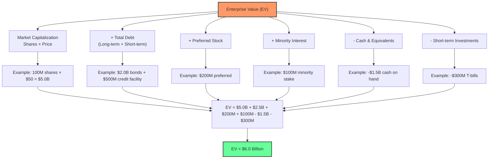

## What Is Enterprise Value (EV)?

**Enterprise Value (EV)** is a comprehensive measure of a company's total value that represents the theoretical takeover price. Unlike market capitalization, which only considers equity value, EV accounts for the entire capital structure including debt, making it a more accurate representation of a company's true economic value.

Think of EV as the price tag if you wanted to buy the entire company outright -- not just the shares, but the whole operation including its debts and obligations. If market cap is "what stockholders own," EV is "what the whole business costs."

### Enterprise Value Formula

    EV = Market Cap + Total Debt - Cash and Cash Equivalents

More detailed formula:

    EV = (Shares Outstanding × Stock Price) + Total Debt + Preferred Stock + Minority Interest - Cash - Short-term Investments

### Why Cash Is Subtracted

Cash reduces the acquisition cost because:
- You're buying the company AND getting cash back
- Cash doesn't generate operating returns
- It's immediately available to the acquirer
- Reduces the net investment required

**Example:** If you buy a company for **$100M** but it has **$20M** cash, your net cost is effectively **$80M**. You're paying $100M for the equity, but the first thing you can do as the new owner is pull $20M out of the company's bank account. Debt works the opposite way -- you're assuming liability for it.

### EV vs Market Cap

**Market Cap** = `Shares Outstanding × Stock Price`
- Only considers equity holders
- Ignores debt obligations
- Misleading for leveraged companies

**Enterprise Value:**
- Includes all stakeholders (equity + debt)
- Better for comparing companies with different capital structures
- More relevant for M&A analysis

**Example Comparison:**

Company A: Market Cap **$1B**, No Debt, **$100M** Cash
`EV = $1B + $0 - $100M = $900M`

Company B: Market Cap **$800M**, **$300M** Debt, **$50M** Cash
`EV = $800M + $300M - $50M = $1.05B`

Company B is actually more expensive despite lower market cap. If you bought Company B, you'd pay $800M for the equity and then be on the hook for $300M in debt, minus $50M cash. That's $1.05B total. Company A costs $900M all-in despite its higher market cap. This is why EV matters -- market cap alone is deceptive.

### Key EV Applications

1. **Valuation Multiples**
   - `EV/Revenue`: Compares total value to sales
   - `EV/EBITDA`: Most common, compares value to operating cash flow
   - `EV/EBIT`: Similar but includes depreciation effects
   - `EV/Free Cash Flow`: Compares to actual cash generation

2. **M&A Analysis**
   - True acquisition cost calculation
   - Cross-border deal comparisons
   - Debt assumption considerations
   - Cash flow availability assessment

3. **Comparative Analysis**
   - Compare companies regardless of capital structure
   - Industry benchmarking
   - Relative valuation screening
   - Investment opportunity identification

4. **Capital Structure Decisions**
   - Optimal debt/equity mix
   - Cost of capital analysis
   - Leverage impact on valuation
   - Refinancing considerations

### EV/EBITDA Deep Dive

Most popular EV multiple because:
- Removes capital structure effects
- Excludes non-cash charges
- Industry-standardized metric
- Easy to calculate and compare

**Typical EV/EBITDA Ranges:**
- **Growth stocks:** 15-30x
- **Mature companies:** 8-15x
- **Cyclical industries:** 5-12x
- **Distressed situations:** 3-8x

**Worked Example -- Comparing Two SaaS Companies:**

| Metric | CloudCo | DataCo |
|--------|---------|--------|
| Market Cap | $10B | $8B |
| Debt | $2B | $500M |
| Cash | $1B | $3B |
| **EV** | **$11B** | **$5.5B** |
| EBITDA | $500M | $400M |
| **EV/EBITDA** | **22.0x** | **13.75x** |

CloudCo looks bigger by market cap, but DataCo is actually the better value play. DataCo's EV is only half of CloudCo's despite generating 80% as much EBITDA. DataCo's fortress balance sheet (low debt, high cash) makes it cheaper on an enterprise basis.

**The lesson:** Always compare on EV multiples, never on P/E alone. P/E ignores the balance sheet entirely.

### EV/Revenue: When Profits Don't Exist Yet

For high-growth companies with no earnings, EV/Revenue is the go-to metric:

- **< 5x EV/Revenue:** Potentially undervalued (if growth is strong)
- **5-15x EV/Revenue:** Typical for healthy SaaS/growth companies
- **15-30x EV/Revenue:** Premium growth -- better be growing 40%+ annually
- **30x+ EV/Revenue:** Bubble territory unless the company is genuinely category-defining

**The rule of 40:** A SaaS company's growth rate + profit margin should exceed 40%. A company growing at 50% with -10% margins (net = 40%) deserves a higher EV/Revenue than one growing at 20% with 15% margins (net = 35%).

### EV Calculation Challenges

1. **Debt Complexity**
   - Operating vs. financial leases
   - Off-balance-sheet obligations
   - Convertible securities
   - Pension liabilities

2. **Cash Classification**
   - Restricted vs. available cash
   - Foreign cash trapped overseas
   - Required operating cash levels
   - Short-term investment categorization

3. **Timing Issues**
   - Market cap fluctuates daily
   - Debt figures from quarterly reports
   - Cash balances may be stale
   - Seasonal working capital changes

4. **Special Situations**
   - Spin-offs and divestitures
   - Joint ventures and associates
   - Minority interests
   - Stock-based compensation

### Advanced EV Considerations

**Adjusted Enterprise Value:**
- **Add:** Pension deficits, environmental liabilities
- **Subtract:** Excess real estate, non-operating assets
- **Consider:** Litigation reserves, regulatory obligations

**EV for Different Industries:**

**Technology:**
- Minimal debt typically
- High cash balances
- Focus on `EV/Revenue` multiples
- Growth vs. profitability trade-offs

**Utilities:**
- High debt levels (regulated returns)
- Stable cash flows
- `EV/EBITDA` standard
- Regulatory asset base considerations

**REITs:**
- Specific debt structures
- FFO-based metrics preferred
- Property valuation complexities
- Distribution requirements

**Energy:**
- Commodity price sensitivity
- Reserve-based valuations
- Cyclical cash flows
- Environmental liabilities

### Using EV in MarketWizardry

Our EV Explorer analyzes:
- Real-time EV calculations
- Historical EV trends
- Industry comparative analysis
- Multiple expansion/contraction
- Debt/equity optimization scenarios

**Screening capabilities:**
- EV/Revenue screening
- EV/EBITDA filtering
- Cash-adjusted metrics
- Sector-specific analysis

Try our free EV Explorer tool: [EV Explorer](https://marketwizardry.org/ev-explorer.html)

**Related Reading:**
- [What is Value at Risk (VaR)?](https://marketwizardry.org/blog/what-is-value-at-risk-var.html)
- [What is Average True Range (ATR)?](https://marketwizardry.org/blog/what-is-average-true-range-atr.html)
- [Understanding IQR Analysis](https://marketwizardry.org/blog/understanding-iqr-analysis.html)

### Common EV Mistakes

1. **Stale Data Usage** -- Using outdated debt or cash figures with current market cap
2. **Debt Oversimplification** -- Ignoring off-balance-sheet obligations or complex securities
3. **Cash Misclassification** -- Including restricted or operationally required cash
4. **Multiple Misapplication** -- Using inappropriate multiples for specific industries
5. **Currency Confusion** -- Mixing different currencies without proper conversion
6. **Timing Mismatch** -- Combining market data from different time periods
7. **Ignoring dilution** -- Not accounting for options, warrants, and convertible debt that increase share count

### EV Investment Strategies

**Value Investing:**
- Low `EV/EBITDA` screening
- Cash-rich, debt-light companies
- Asset-heavy undervalued situations
- Special situation opportunities

**Growth Investing:**
- `EV/Revenue` for early-stage companies
- Multiple expansion potential
- Scalability assessment
- Market opportunity sizing

**Event-Driven:**
- M&A arbitrage using EV analysis
- Spin-off valuation discrepancies
- Distressed debt situations
- Capital structure changes

### The Reality of EV

Enterprise Value is the closest thing to an objective company valuation, but it's still built on subjective market prices and accounting estimates.

EV doesn't predict stock performance -- it's a tool for understanding relative value and making informed comparisons. Markets can remain irrational far longer than your portfolio can remain solvent.

Use EV as part of a comprehensive analysis framework. It's excellent for screening opportunities and understanding capital structure implications, but it won't tell you when to buy or sell.

Remember: A company might be cheap on an EV basis and still get cheaper. Or expensive and get more expensive. The market's voting machine can be wildly erratic in the short term.

EV helps you understand what you're buying, not whether you should buy it. That decision requires combining quantitative analysis with qualitative judgment -- something no spreadsheet can provide.

Because in the end, Enterprise Value measures what the market thinks a company is worth, not what it's actually worth. Those can be very different things.
