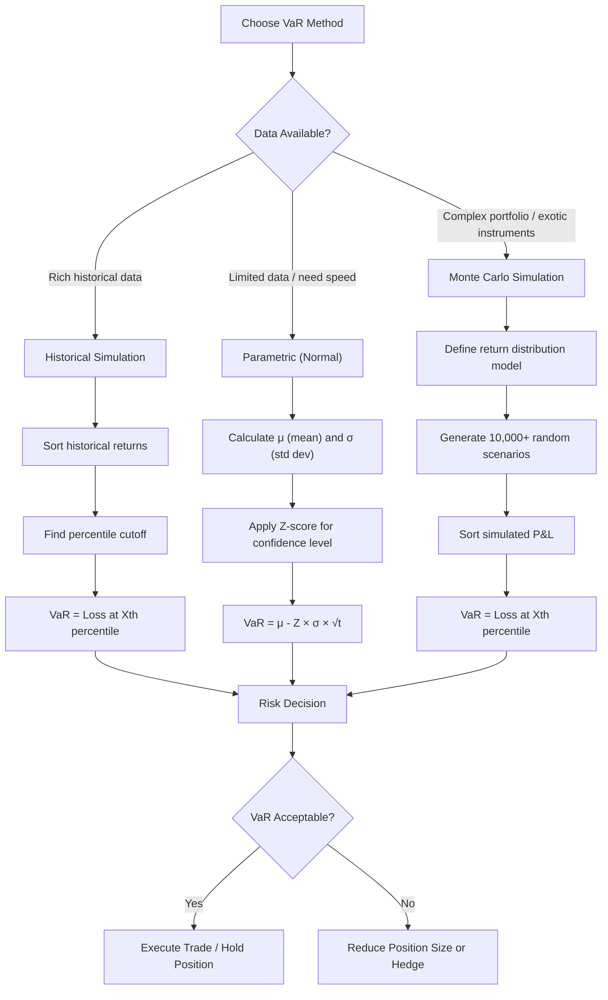

## What Is Value at Risk (VaR)?

**Value at Risk (VaR)** is a statistical measure that quantifies the potential loss of an investment or portfolio over a specific time period, given a certain confidence level. It answers the question: "What's the worst loss I can expect with **X%** confidence over **Y** days?"

If you're running any kind of serious risk management system -- whether it's a personal trading account or an institutional portfolio -- VaR is the lingua franca. It's how risk gets communicated, budgeted, and constrained across the entire financial industry. Ignore it at your peril.

### How VaR Works

VaR is expressed as a dollar amount or percentage and consists of three components:
- **Time horizon** (e.g., 1 day, 10 days, 1 month)
- **Confidence level** (e.g., 95%, 99%)
- **The potential loss amount**

For example, a 1-day **95% VaR** of **$10,000** means: "There's a 95% chance that the portfolio won't lose more than $10,000 tomorrow."

Flip it around: there's a **5% chance** (roughly 1 trading day per month) that your losses will exceed $10,000. That's the tail risk you're accepting.

### VaR Calculation Methods



1. **Historical Simulation**
   - Uses historical price data to simulate potential losses
   - Simple but assumes past patterns will repeat
   - No distribution assumptions required

2. **Parametric (Normal Distribution)**
   - Assumes returns follow a normal distribution
   - Faster to calculate but may underestimate tail risks
   - Formula: `VaR = μ - (Z × σ × √t)`

3. **Monte Carlo Simulation**
   - Generates thousands of random scenarios
   - Most flexible but computationally intensive
   - Can model complex portfolios and dependencies

### Worked Example: Computing 1-Day 95% VaR

Let's make this concrete. Suppose you have a **$500,000** portfolio invested in S&P 500 exposure.

**Parametric Method:**
- Mean daily return (μ): **0.04%** ($200)
- Daily standard deviation (σ): **1.2%** ($6,000)
- Z-score for 95% confidence: **1.645**

```
VaR = μ - (Z × σ)
VaR = $200 - (1.645 × $6,000)
VaR = $200 - $9,870
VaR = -$9,670
```

Interpretation: On **95%** of trading days, your portfolio will not lose more than **$9,670**. On the remaining **5%** of days (~1 per month), losses could exceed this threshold.

**Historical Method (same portfolio):**
- Collect 252 daily returns (1 year of trading days)
- Sort returns from worst to best
- The 13th worst day (5th percentile of 252) = your VaR
- If the 13th worst day was a **-2.1%** move: VaR = **$10,500**

**Monte Carlo Method:**
- Model returns as a distribution (normal, t-distribution, or GARCH)
- Simulate 50,000 daily scenarios
- Find the 5th percentile of simulated P&L
- Result might be **$10,200** (captures fat tails better than parametric)

Notice the three methods give slightly different answers. That's normal. The parametric method tends to underestimate because real markets have fatter tails than a normal distribution predicts.

### Scaling VaR Across Time Horizons

A critical skill: converting between time horizons using the square root of time rule.

```
VaR(T days) = VaR(1 day) × √T
```

Using our **$9,670** 1-day VaR:
- **10-day VaR** (regulatory standard): $9,670 × √10 = **$30,577**
- **21-day VaR** (monthly): $9,670 × √21 = **$44,310**
- **63-day VaR** (quarterly): $9,670 × √63 = **$76,747**

**Warning:** The square root rule assumes returns are independent and identically distributed. In reality, volatility clusters -- bad days tend to follow bad days. This means the square root rule *underestimates* longer-horizon VaR during crisis periods.

### VaR Limitations

Critical weaknesses every trader should understand:

1. **Tail Risk Blindness**
   VaR tells you nothing about losses beyond the confidence level. A 99% VaR ignores the catastrophic 1% of scenarios. Your 95% VaR might be $10,000, but the average loss in that worst 5%? Could be $50,000. VaR doesn't tell you.

2. **Model Risk**
   VaR is only as good as its underlying assumptions. Black swan events regularly violate these assumptions. LTCM had sophisticated VaR models. They blew up anyway.

3. **False Security**
   VaR can create overconfidence. Just because you have a 95% VaR doesn't mean the other 5% won't bankrupt you. The 2008 financial crisis was a "25-sigma event" under normal distribution assumptions -- mathematically impossible, yet it happened.

4. **Non-Additive**
   Portfolio VaR does not equal the sum of individual position VaRs due to correlations and diversification effects. A portfolio with two negatively correlated assets has lower VaR than either asset alone.

5. **Procyclicality**
   VaR models using recent data become more permissive during calm markets (encouraging risk-taking) and more restrictive during crises (forcing liquidation at the worst time). This amplifies market cycles rather than dampening them.

### Practical Applications

**Risk Management:**
- Set position sizing limits
- Determine portfolio exposure
- Stress test strategies
- Regulatory compliance (Basel III)

**Trading Applications:**
- Stop-loss level setting
- Capital allocation decisions
- Performance attribution
- Risk-adjusted returns calculation

**Real-World Position Sizing with VaR:**

Suppose your risk budget is a maximum **1-day 95% VaR** of **$5,000** on any single position. You want to trade AAPL (daily σ = 1.8%).

```
Max Position = VaR_limit / (Z × σ)
Max Position = $5,000 / (1.645 × 0.018)
Max Position = $5,000 / 0.02961
Max Position = $168,862
```

At AAPL's price of ~$200, that's roughly **844 shares** maximum. Any more and you're exceeding your risk budget.

### VaR vs Other Risk Metrics

**Expected Shortfall (ES):**
- Measures average loss beyond VaR threshold
- Better for tail risk assessment
- More coherent risk measure
- If your 95% VaR is $10,000, ES answers "when we DO lose more than $10,000, how much do we lose on average?"

**Maximum Drawdown:**
- Historical worst peak-to-trough loss
- Backward-looking vs VaR's forward-looking nature
- Useful for understanding pain tolerance

**Standard Deviation:**
- Measures total volatility (up and down)
- VaR focuses only on downside risk
- Complementary metrics

### Common VaR Mistakes

1. Over-reliance on historical data
2. Ignoring regime changes and structural breaks
3. Using inappropriate time horizons
4. Misunderstanding confidence intervals
5. Failing to backtest VaR models
6. Using parametric VaR on assets with fat-tailed distributions (crypto, biotech)
7. Ignoring correlation breakdown during crises (correlations go to 1 when everything sells off)

### Industry Standards

**Typical confidence levels:**
- **95%** for internal risk management
- **99%** for regulatory capital requirements
- **99.9%** for extreme stress testing

**Time horizons:**
- **1-day** for active trading
- **10-day** for regulatory purposes
- **Monthly/quarterly** for strategic allocation

### The MarketWizardry VaR Explorer

Our VaR calculator implements multiple methodologies and provides:
- Historical simulation with customizable lookback periods
- Parametric VaR with distribution fitting
- Portfolio-level risk aggregation
- Stress testing scenarios
- Risk decomposition by asset class

Try our free VaR Explorer tool: [VaR Explorer](https://marketwizardry.org/var-explorer.html)

**Related Reading:**
- [What is Average True Range (ATR)?](https://marketwizardry.org/blog/what-is-average-true-range-atr.html)
- [Understanding IQR Analysis](https://marketwizardry.org/blog/understanding-iqr-analysis.html)
- [VaR Rubber Band Effect on Darwinex](https://marketwizardry.org/blog/var-rubber-band-effect-darwinex.html)

---

Remember: VaR is a tool, not a crystal ball. It provides estimates based on historical patterns and mathematical models. In volatile markets, these patterns can break down spectacularly.

The goal isn't to predict the future perfectly -- it's to quantify uncertainty so you can make informed decisions about how much risk you're willing to accept for potential returns.

Use VaR as one input among many in your risk management framework. Combine it with stress testing, scenario analysis, and good old-fashioned common sense.

Because in the end, the market doesn't care about your VaR calculations when it decides to have a nervous breakdown.
