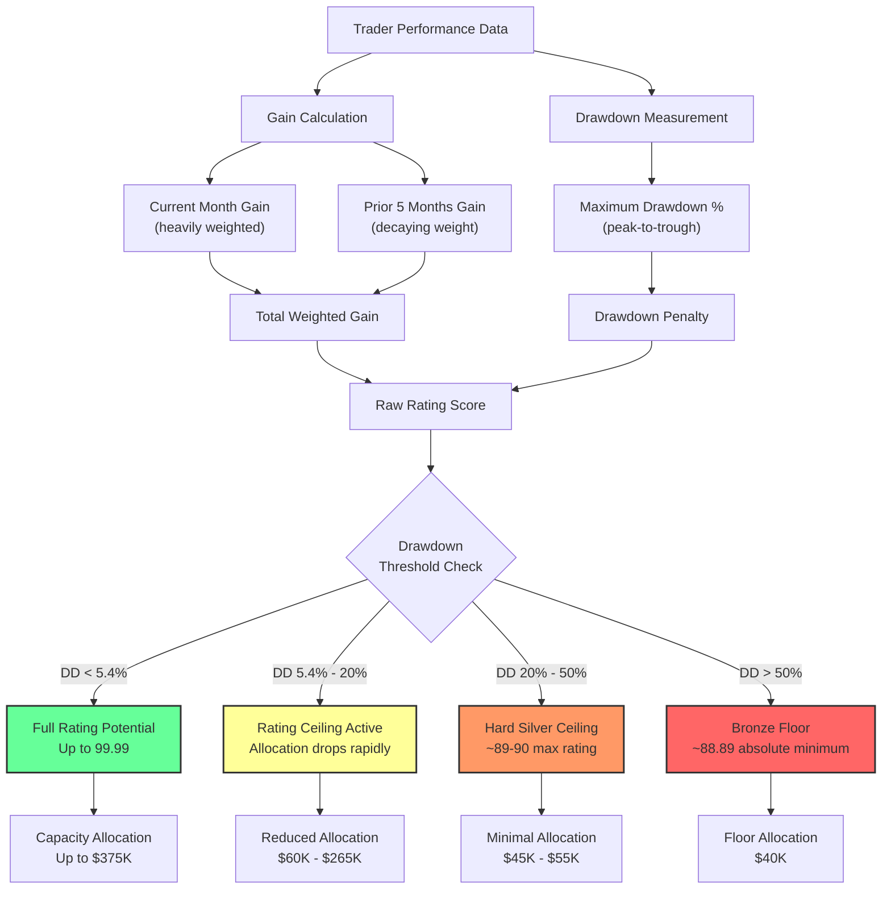
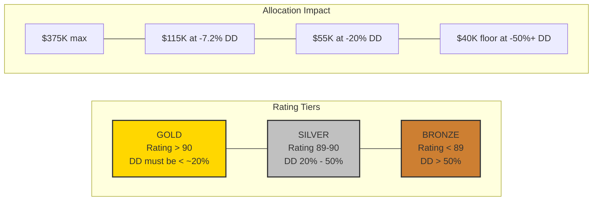

## Darwinex Rating Analysis: Rating Caps Under Optimal Gain Conditions

The CSV at [Darwinex_Rating_Cap CSV](https://github.com/TyphooN-/Darwin_Research/blob/main/Darwinex_Rating_Cap_20250329_114201.csv) uses intentionally high gains (**50%** current month + **50%** prior 5 months = **100%** total) to isolate and identify pure rating caps based on drawdown levels, removing gain limitations from the equation.

### How the Darwinex Rating System Works

Before diving into the caps, understand the rating calculation flow:

The key insight: **drawdown creates hard ceilings that no amount of gain can overcome**. The rating system is fundamentally asymmetric -- it penalizes risk far more than it rewards returns. This is by design. Darwinex is protecting investor capital, not celebrating cowboys.

### Key Rating Caps at Critical Drawdown Thresholds

**Major Allocation Drops:**
- **-5.4%:** First significant drop from **375k** to **265k** (-29% allocation)
- **-6.1%:** Down to **220k** (-17% further drop)
- **-6.3%:** Down to **190k** (-14% further drop)
- **-6.9%:** Down to **165k** (-13% further drop)
- **-7.2%:** Sharp drop to **115k** (-30% allocation cut)
- **-16.3%:** From 65k to **60k** (another threshold)
- **-20.0%:** From 60k to **55k**
- **-22.1%:** From 55k to **50k**
- **-28.8%:** From 50k to **45k**
- **-49.6%:** Final drop from 45k to **40k**

**The cliff at -5.4% is the most brutal.** Going from 375k to 265k means losing nearly a third of your allocation for a drawdown that most traders would consider minor. This is the Darwinex risk engine telling you in no uncertain terms: **protect your equity curve**.

The second cliff at **-7.2%** (dropping from 165k to 115k) is equally savage. By the time you hit -7.2% drawdown, you've lost **70%** of your maximum allocation potential. Seven percent drawdown. Let that sink in.

### Rating Ceiling Analysis (with 100% Gains)

- At **-0.1% DD:** 99.99 rating (near-maximum possible)
- At **-10% DD:** 94.02 rating
- At **-20% DD:** 90.67 rating (barely gold threshold)
- At **-40% DD:** 89.15 rating (silver ceiling despite 100% gains)
- At **-100% DD:** 88.89 rating (absolute floor)

### The 2.5 Gain-to-Drawdown Ratio Revealed

With **100%** total gains in this model, the rating caps become visible:
- **-20%** drawdown: **90.67** rating (`100% gains / 20% DD = 5:1 ratio` still achieves gold)
- **-40%** drawdown: **89.15** rating (`100% gains / 40% DD = 2.5:1 ratio` falls short of gold)

This confirms the **2.5:1 minimum threshold**: even with exceptional 100% gains, 40%+ drawdown prevents gold rating.

**What this means in practice:** If your strategy has a 15% max drawdown, you need at least ~37.5% gains to have a shot at gold (15% × 2.5). If your drawdown is 25%, you need 62.5% gains -- and even then, you're bumping against the ceiling. The message is clear: **control drawdown first, chase returns second**.

### Real-World Implications: Rating Ceilings in Action

**Scenario 1: The "Perfect Storm" Trader (15% drawdown)**
- With 100% gains: Rating = ~**92.5** (Gold achieved)
- *Reality Check:* This represents an extremely rare combination of high returns with moderate risk

**Scenario 2: The "High Performer" (25% drawdown)**
- With 100% gains: Rating = ~**89.8** (Silver ceiling)
- *Insight:* Even doubling investor money isn't enough if drawdown exceeds ~20%

**Scenario 3: The "Exceptional Trader" (40% drawdown)**
- With 100% gains: Rating = **89.15** (Hard silver ceiling)
- *Critical Finding:* No amount of additional gains can overcome this drawdown penalty

**Scenario 4: The "Extreme Risk-Taker" (60%+ drawdown)**
- Rating locked at ~**88.89** (Bronze ceiling)
- Allocation: Permanent **40k** floor regardless of gains

### Key Discovery: Absolute Rating Ceilings

This spreadsheet reveals that rating caps are absolute -- beyond certain drawdown levels, no amount of gains can achieve gold:

- **-20% to -22%:** Last chance for gold (requires exceptional gains)
- **-25% to -40%:** Silver ceiling zone (89.0-89.9 rating maximum)
- **-50%+:** Bronze ceiling (sub-89 rating regardless of performance)

The high gain assumption exposes how Darwinex prioritizes risk management over pure returns, creating hard ceilings that exceptional performance cannot overcome.

### Strategic Implications for Traders

This data should fundamentally change how you approach Darwinex:

1. **Drawdown is permanent damage.** Unlike gains which decay over time, a deep drawdown creates a ceiling that takes months of perfect trading to overcome. Prevention is worth more than cure.

2. **The first 5% matters most.** The allocation cliff from 375k to 115k happens between 0% and 7.2% drawdown. This tiny window determines whether you're managing institutional capital or table scraps.

3. **Recovery math is asymmetric.** If you suffer a 20% drawdown, you need 25% gains just to break even on your equity -- and your rating is already capped at silver regardless of how spectacular your recovery is.

4. **Design your strategy around drawdown constraints.** If you're targeting DarwinIA allocation, your maximum acceptable drawdown is roughly 5%. Not 10%, not 15% -- five percent. Build your risk management around this constraint from day one.
